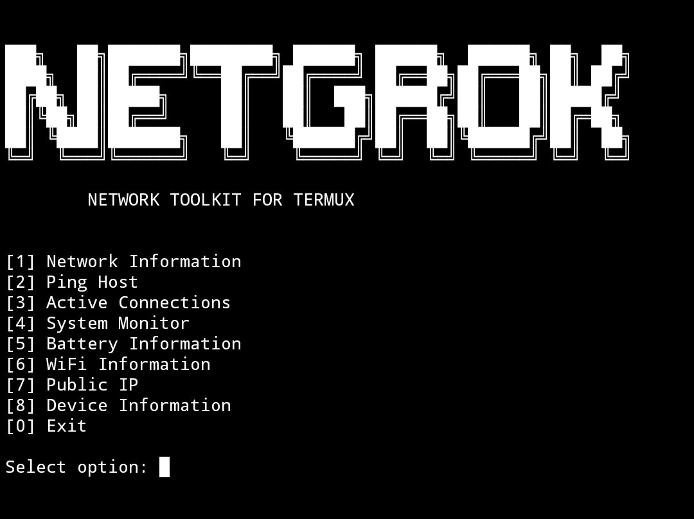

# NETGROK

Advanced Network & System Toolkit for Termux.

NETGROK is an open-source terminal-based toolkit focused on network diagnostics, system monitoring, and Android/Termux utilities.

This project was created with educational purposes in mind, to learn about:

- C++
- Linux/Android terminals
- Networking
- System monitoring
- Termux APIs
- Terminal user interfaces (TUI)

---

# Status

NETGROK is currently under active development.

This is an early experimental version and some features may:

- behave differently depending on the device,
- require additional permissions,
- or stop working on certain Android versions.

The project will continue improving over time.

---

# Features

- Network information
- WiFi information
- Public IP viewer
- Ping utility
- Active connection viewer
- System monitor
- Battery information
- Device information
- IP geolocator
- Scan ports

---

# Platform

Currently designed for:

- Android
- Termux
- Termux:API

---

# Educational Purpose

NETGROK was developed for educational and research purposes only.

This project is intended to:

- help users learn networking concepts,
- explore Android terminal capabilities,
- and practice systems programming with C++.

The author does not encourage malicious usage.

---

# Installation

Install dependencies in Termux:

pkg update && pkg upgrade
pkg install clang
pkg install termux-api
pkg install curl
pkg install iproute2
pkg install procps
pkg install python
pkg install traceroute
pkg install dnsutils
pkg install net-tools

Compile:

clang++ main.cpp -o netgrok

Run:

./netgrok

---

# License

This project is licensed under the Apache-License 2.0 License.

---
# Screenshots

